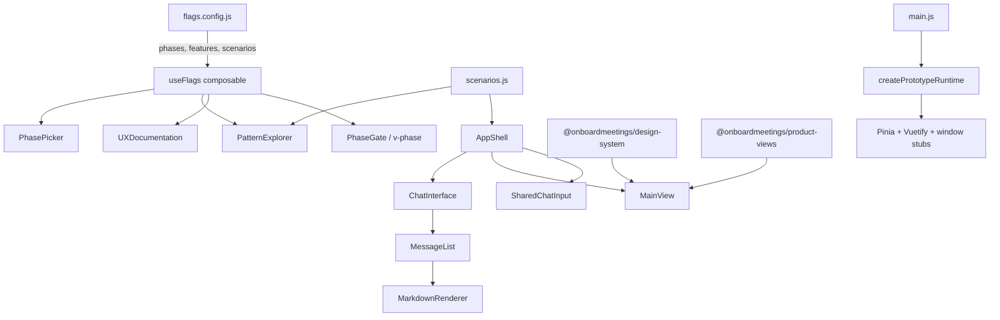

# Architecture

## Overview

This prototype demonstrates UX patterns for [Your Feature Name]. It uses a scenario-based approach where conversation flows are pre-authored and switchable via the Pattern Explorer sidebar.

## System Diagram

## Key Decisions

| Decision | Choice | Rationale |
|----------|--------|-----------|
| State management | Local refs + composables; Pinia only for product-view fixtures | Prototype scope; Pinia stays idle unless product-views are used |
| Feature flags | Config file + composable | Designers edit one file, no code changes |
| Phase assignment | Centralized in flags.config.js | Single source of truth, not scattered |
| Markdown rendering | markdown-it + custom plugins | Rich content blocks without Vue component overhead |
| Chat layout | Split/Hidden/Fullscreen modes | Demonstrates responsive AI panel patterns |
| Design system | Versioned npm packages on GitHub Packages | Designers `npm update` instead of `git subtree pull`; prototypes pin exact versions |
| Styling split | Tailwind for meta-chrome; Vuetify+SCSS scoped to `#ob-app-core` | Scaffolding stays lightweight; product fidelity inside the viewport only |

## Component Inventory

| Component | Location | Purpose |
|-----------|----------|---------|
| AppShell | layout/ | Main layout: sidebar, content area, chat panel |
| ChatInterface | layout/ | Message display with scroll management |
| PatternExplorer | layout/ | Scenario browser sidebar |
| SidebarNav | layout/ | Product navigation (configurable) |
| MainView | layout/ | Skeleton content area |
| SharedChatInput | layout/ | Morphing CTA → input with drag support |
| PhasePicker | flags/ | Phase toggle in header |
| PhaseBadge | flags/ | Colored phase indicator |
| PhaseGate | flags/ | Conditional render wrapper |
| FeatureEpic | docs/ | Feature group with copy support |
| FeatureStory | docs/ | Story card with AC and copy support |
| MarkdownRenderer | markdown/ | Rich markdown with custom blocks |

## Design System and Product Views

The OnBoard design system and product views are consumed as **npm packages** from GitHub Packages:

- `@onboardmeetings/design-system` — OB* primitives (OBButton, …) wrapping Vuetify with real product SCSS tokens and Lato font aliases
- `@onboardmeetings/product-views` — extracted real screens plus `createPrototypeRuntime()`, which installs Pinia, Vuetify (light theme), and stubs for `window.OB_Env`, `window.__obOrgHeaders`, `window.__obUserManager`, and the Axios `baseApi` fixture registry

Both packages target `
` in `src/App.vue`. Styling inside that container matches production; anything outside it (header, browser frame, pattern explorer) stays on the template's Tailwind.

See `GETTING_STARTED.md` for GitHub Packages auth setup and usage examples.

## TODO

- [ ] Add feature-specific scenarios
- [ ] Define features and stories in flags.config.js
- [ ] Customize SidebarNav for your product
- [ ] Replace brand colors in tailwind.config.js
- [ ] Add FTUX tour steps if needed
